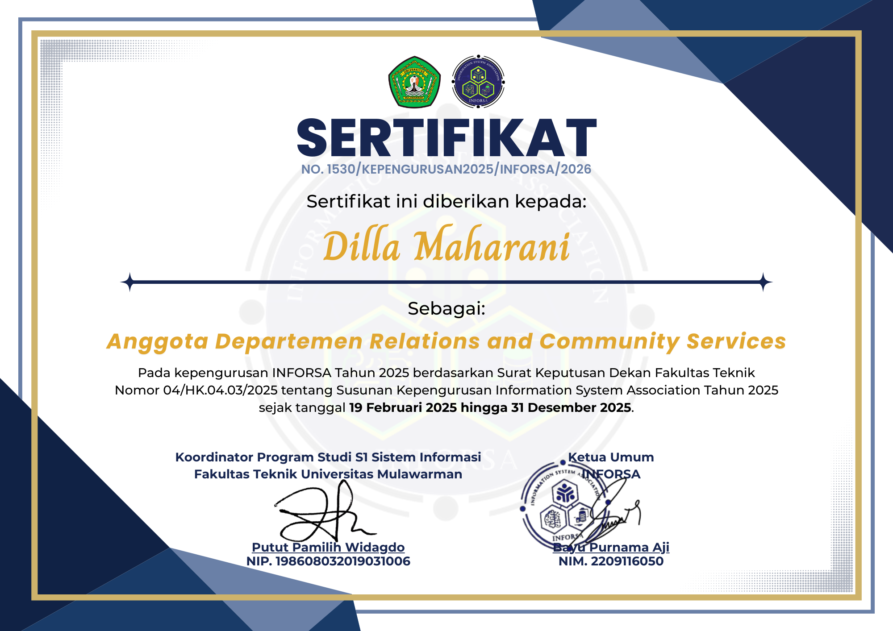

# Website Portofolio (HTML + CSS) ──★ ˙🍓 ̟ !!

Nama   : Dilla Maharani

NIM    : 2409116023

Kelas  : Sistem Informasi A'24

---

## ──★ ˙Deskripsi Website

Website ini merupakan website portofolio statis berbasis HTML + CSS dengan 3 section utama:
- **Home (Hero Section)**: perkenalan singkat + foto
- **About Me**: deskripsi diri, skill (progress bar), dan pengalaman.
- **Certificates**: daftar sertifikat dalam bentuk card.

---

## ──★ ˙Fitur-Fitur
- Navbar (header + menu navigasi ke section)
- Section **Home** (Hero) berisi perkenalan singkat + gambar
- Section **About Me** berisi deskripsi diri, skills dengan progress bar, dan pengalaman 
- Section **Certificates** berisi sertifikat dalam card / grid  
- Menggunakan struktur dasar HTML (html, head, body)  
- Menggunakan CSS untuk styling (warna, background, layout, font, dll)  
- Tampilan rapi dan responsif (dibantu Bootstrap + flex)  
- Website bersifat statis

---

## ──★ ˙Teknologi yang Digunakan
- **HTML5**

  Struktur dasar pembuatan website (html, head, body, section, navbar, dll)
  
- **CSS3**
  
  Styling tampilan (warna, layout, background, font, progress bar, dll)
  
- **Bootstrap 5** (CDN)
  
  Digunakan untuk membantu pembuatan komponen Card pada section Certificates

---

## ──★ ˙Struktur Folder

```
project-folder/
│
├── index.html
├── style.css
└── images/
    ├── mypoto.png
    ├── instagram.png
    ├── inforsa.png
    ├── pengmas.jpg
    └── makrab.png
```

---

## ──★ ˙Tampilan dan Penjelasan Code Setiap Section / Fitur

### 1) Navbar


**Fungsi:**
- Menampilkan identitas singkat “My Portofolio ♡”
- Navigasi anchor link ke setiap section `#home`, `#about`, `#certificate`
- Menampilkan ikon instagram + username

#### ✿ HTML
```html
<header>
  <div class="container-navbar">
    <div class="logo">My Portofolio ♡</div>
    <nav>
      <a href="#home">Home</a>
      <a href="#about">About Me</a>
      <a href="#certificate">Certificate</a>
    </nav>
  </div>
</header>
```
- ```<header>``` → membungkus area navbar

- ```href="#home"``` → mengarahkan ke section dengan id home

- ```.container-navbar``` → mengatur layout navbar

#### ✿ CSS
```css
.container-navbar{
  display: flex;
  justify-content: space-between;
  align-items: center;
}
```
- ```display: flex;``` → membuat logo dan menu sejajar

- ```justify-content: space-between;``` → memberi jarak kiri & kanan
  
- ```align-items: center;``` → membuat posisi vertikal rata tengah

---

### 2) Home (Hero Section)


**Fungsi:**
- Menampilkan perkenalan singkat
- Menampilkan 1 gambar profil

#### ✿ HTML
```html
<section id="home">
  <div class="container-home">
    <div class="teksperkenalan">
      <h1>Halo, Saya Dilla Maharani</h1>
      <p>Mahasiswa Sistem Informasi...</p>
    </div>

    <div class="fotoku">
      
    </div>
  </div>
</section>
```

- ```id="home"``` → id agar bisa dipanggil dari navbar

- ```.container-home``` → membagi layout menjadi 2 kolom

- `````` → tag untuk mengupload gambar

#### ✿ CSS
```css
.container-home{
  display: flex;
  align-items: center;
  justify-content: space-between;
  gap: 30px;
}

.fotoku img{
  max-width: 300px;
  border-radius: 20px;
}
```

- ```display: flex;``` → membuat teks & gambar sejajar

- ```gap``` → memberi jarak antar kolom

- ```border-radius``` → membuat sudut gambar membulat/menumpul
 
---

### 3) About Me
Section ini terdiri dari deskripsi, skills, dan pengalaman.


#### a) Deskripsi Diri

##### ✿ HTML
```html
<div class="deskripsi">
  <h2>About Me</h2>
  <p>Saya adalah mahasiswa...</p>
</div>
```

##### ✿ CSS
```css
.deskripsi{
  padding: 40px;
  border-radius: 20px;
}
```

- Digunakan sebagai wadah teks profil

- Diberi padding agar tidak terlalu rapat

#### b) Skills (Progress Bar)


**Fungsi:** Menampilkan kemampuan dalam bentuk progress bar.

##### ✿ HTML
```html
<div class="skill">
  <p>HTML</p>
  <div class="bar">
    <div class="fill" style="width:80%"></div>
  </div>
</div>
```

- ```.bar``` → background progress bar

- ```.fill``` → isi progress bar sesuai persentase

- ```style="width:80%"``` → menentukan nilai persentase skill

##### ✿ CSS
```css
.bar{
  background: #ddd;
  border-radius: 10px;
  overflow: hidden;
}

.fill{
  height: 10px;
  border-radius: 10px;
}
```

- ```overflow: hidden;``` → agar isi bar tidak keluar background

- ```border-radius``` → membuat progress bar lebih modern dan tumpul

#### c) Pengalaman

##### ✿ HTML
```html
<div class="timeline">
  <div class="timeline-item">
    <h3>Panitia Makrab</h3>
    <p>2024 - Divisi Acara</p>
  </div>
</div>
```

##### ✿ CSS
```css
.timeline{
  position: relative;
  padding-left: 30px;
}

.timeline::before{
  content:"";
  position:absolute;
  left:10px;
  top:0;
  bottom:0;
  width:3px;
}

.timeline-item::before{
  content:"";
  position:absolute;
  left:-24px;
  width:12px;
  height:12px;
  border-radius:50%;
}
```

- ```::before``` → digunakan untuk membuat garis dan titik timeline

- ```position: absolute;``` → untuk mengatur posisi garis
---

### 4) Certificates (Card / Grid)

**Fungsi:**

- Menampilkan daftar sertifikat dalam bentuk card

- Menggunakan Bootstrap 5 untuk komponen card

#### ✿ HTML
```html
<section id="certificate">
  <div class="sertif">
    <div class="card custom-card" style="width: 18rem;">
      
      <div class="card-body">
        <h5 class="card-title">INFORSA 2024</h5>
        <p class="card-text">Sertifikat kepanitiaan...</p>
      </div>
    </div>
  </div>
</section>
```

- ```class="card"``` → komponen dari Bootstrap 5

```.custom-card``` → tambahan styling dari CSS sendiri

#### ✿ CSS
```css
.sertif{
  display: flex;
  gap: 20px;
  flex-wrap: wrap;
}

.custom-card{
  border-radius: 20px;
}
```

- ```flex-wrap: wrap;``` → agar card turun ke bawah jika layar kecil

- ```gap``` → memberi jarak antar card

---

## ──★ ˙Keseluruhan Gambar Tampilan Website


---

## 👩🏻‍💻 Author
**Dilla Maharani**  
© 2026
